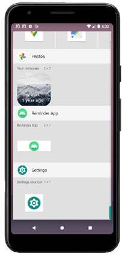
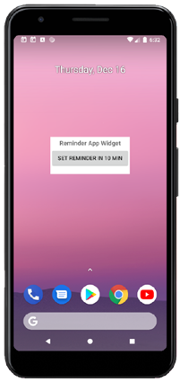

# Android App Library: Widget

## About
Welcome to our Android application. The app is part of the Open Sorce [Android App Library](https://github.com/LukPle/android-app-library.git) 
and adopts all licensing and community guidelines from this project. Please use the link in order to check out the corresponding repository.

The android-widget app contains a **TimePickerDialog** for setting a specific time. Clicking the Button shows a **Toast** message with the selected time. The app also
includes a class that extends **AppWidgetProvider** which can create instances of widgets. A widget offers the possibility to set a timer 10 minutes in the future.

## Features
The setting of this program is a reminder app. The user can select a time via the picker. A Toast message shows this time by setting the reminder. It is possible to 
add a widget to the homescreen of the phone. This widget has a Button which sets the reminder 10 minutes in the future.  

## Usage
You can clone the repository into Android Studio by clicking "Get from VCS" in the Welcome Screen or navigating to "File - New - Project from Version Control" inside 
the IDE. When doing so use the URL provided by GitHub. You can run the app on your mobile device or an emulator. Feel free to modify the code or utilize this sample 
for your own project.
